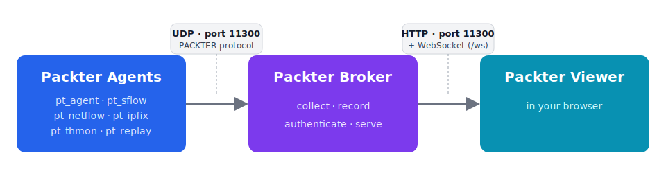

# PACKTER 3.0

*[English](README.md) | 日本語*

**PACKTER** は、インターネットの通信やサイバー攻撃を、リアルタイムの 3D 映像で
見せるツールです。ネットワークの通信を見張る小さなプログラム（「エージェント」）が
データを集め、ブラウザがそれを 1 つ 1 つ「飛ぶ玉」として描きます。2008 年に最初に
公開した PACKTER を、いまの環境向けに作り直した版です。



## 構成

- **broker/** — Rust で書いたブローカー。旧 PACKTER 形式（UDP 11300）の通信を
  受け取り、飛ぶ玉を 33 ミリ秒ごとにまとめてブラウザへ WebSocket で送る。1 つの
  プログラムで、ビューアの配信、直近 5 分の保持（巻き戻し・あとから参加した人への
  追いつき配信）、ファイル録画、通信量の急増監視（thmon）、Suricata の EVE 警報の
  取り込み、エージェントの認証まで行う。
- **agent/** — C 言語のエージェント群（`pt_agent` / `pt_sflow` / `pt_netflow` /
  `pt_ipfix` / `pt_thmon` / `pt_replay`）。PackterAgent 2.5 の全面作り直し。必要な
  ものは libpcap だけ。sFlow/NetFlow/IPFIX の受信ツールは IPv4・IPv6 の両方に対応。
- **web/** — Web ビューア（3D 描画ライブラリ Three.js を使用）。色つきの玉が
  エージェントの壁から受信側の壁へ飛ぶ。壁の枚数を変えられる（真上から見ると
  三角形〜六角形）、巻き戻し、クリックで選択、ポップアップ表示、音、背景（空）の
  差し替え、PNG 保存ができる。
- **tools/** — テスト用の通信を作るスクリプト（`sender.py`）と、素材変換スクリプト。
- **docs/** — インストール手順と配置図。

## クイックスタート

```sh
# 0) まとめてビルド（broker は cargo、agent は autotools。cargo と GNU make が必要）
make

# 1) ブローカー起動（UDP 11300 で受信し、http://localhost:11300/ でビューアを配信）
broker/target/release/packter-broker  web

# 2) エージェントを向ける（実際の通信）
agent/pt_agent -v <ブローカーのIP> -i eth0

#    またはテスト用の通信を流す
python tools/sender.py --pps 300
```

ブラウザで `http://localhost:11300/` を開く。

## エージェントを複数置く（壁を増やす）

ブローカーが各エージェントを壁に割り当て、ビューアが地面の上に壁を輪のように並べます
（真上から見ると、受信側を頂点とした多角形）。

```sh
packter-broker web --boards 4 \
  --agent border-fw=1 --agent dmz-sflow=2 --agent core-tap=3
```

壁の番号は **0 = receiver（着弾先・固定）/ 1 = sender / 2.. = agent2, agent3 …**。
エージェントが `pt_agent -A <id>` で名乗ると、その名前が壁の見出しになります。

| 枚数 | 形 | 例 |
|---|---|---|
| 2 | 向かい合わせ | sender / receiver |
| 3 | 三角形 |  |
| 4 | 四角形 |  |
| 5 | 五角形 |  |
| 6 | 六角形 |  |

## 地球儀ビュー（PACKTEARTH）

送信元と宛先を**緯度・経度**で置き、攻撃を世界地図を貼った地球儀の上の**弧（弾道）**
として飛ばすモード。`http://<broker>:11300/?mode=earth`（または
`?config=config-earth.json`）で起動します。

```sh
pt_agent -v <broker> -i eth0 -G dbip-city-lite.mmdb   # IP を緯度経度に変換（要 ./configure --with-geoip）
python tools/sender.py --earth                         # テスト用（都市間の通信）
```

位置データは **DB-IP「IP to City Lite」（CC BY 4.0）** を推奨。再配布できますが、
**クレジット表示（DB-IP.com へのリンク）が条件**です。MaxMind GeoLite2 は再配布
できないため推奨しません。

## ビューアの操作

`S`=停止 / `C`=ライブに戻る / `B`,`F`=コマ送り / `Backspace`=5 分戻す /
スライダー=頭出し / `Space`=画面情報の表示切替 / `1`-`9`=壁を隠す /
`H`=自動回転（横） / `V`=自動回転（縦） / `P`=PNG 保存 /
クリック=飛ぶ玉を選ぶ / ドラッグ=手動で視点を回す。

## ドキュメント

- ビルドと実行（broker / agent / viewer）: [日本語](docs/INSTALL.md) / [English](docs/INSTALL.en.md)
- ワイヤプロトコル（エージェントが送る UDP メッセージ）: [docs/PROTOCOL.md](docs/PROTOCOL.md)（英語）

## 互換性

ブローカーの受信処理は次をすべて受け入れます（寛容な受信）。**既存の PackterAgent 2.5
は、手を入れずそのまま使えます**。

- `PACKTER\n` ＋ レコードの列挙（通常のまとめ送り）／組の繰り返し／`PACKTER <レコード>`（1 行）
- 旧 `PACTER` ヘッダ、`PACKTERBALLISTIC`、`PACKTERWITHGATEWAY`、`PACKTEARTH`（GeoIP）
- 制御メッセージ: `PACKTERMSG` / `PACKTERHTML` / `PACKTERSE` / `PACKTERSOUND` /
  `PACKTERVOICE` / `PACKTERSKYDOMETEXTURE`
- 座標の欄: IPv4 / IPv6 / 正規化座標（0〜1）／整数（1〜65536）

## ライセンス

コード: BSD 2-Clause。素材（背景の空・flag 色・壁のテクスチャなど）は旧 PACKTER
プロジェクト由来で、Creative Commons Attribution（CC BY）です。
