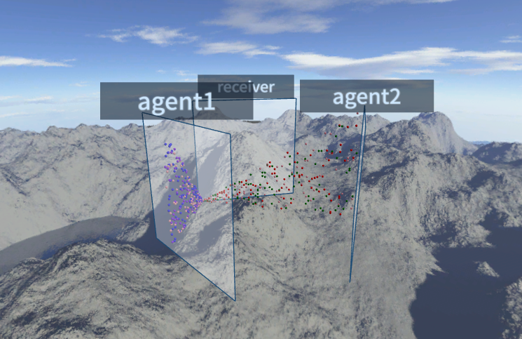
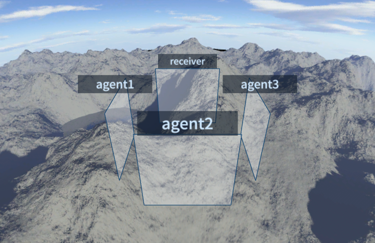
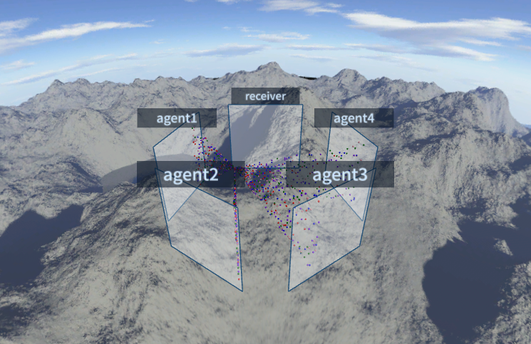
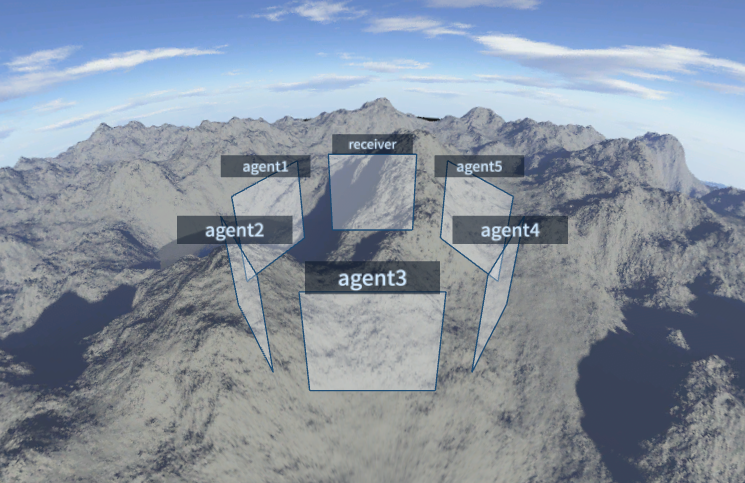

# PACKTER 3.0

インターネットトラフィック／サイバー攻撃の 3D 可視化ツール **PACKTER** の現代化版
（2008年初版の後継）。エージェントが集めたトラフィックを、ブラウザ上で飛翔体として
リアルタイムに可視化します。

```
旧 PackterAgent ──UDP 11300──▶ packter-broker(Rust) ──WebSocket──▶ Web ビューア(Three.js)
 (pt_agent 等)                  集約・録画・認証・配信              ブラウザで可視化
```

## 構成

- **broker/** — Rust製ブローカー。旧Packterプロトコル（UDP 11300）を互換受信し、
  33msごとにバッチした飛翔体をWebSocketバイナリで配信。Webビューアの静的配信、
  直近5分のリングバッファ（巻き戻し・途中参加バックフィル）、JSONL録画、
  しきい値監視（thmon）、Suricata EVE取り込み、エージェント認証も担う単一バイナリ
- **agent/** — C言語のエージェント群（`pt_agent` / `pt_sflow` / `pt_netflow` /
  `pt_ipfix` / `pt_thmon` / `pt_replay`）。PackterAgent 2.5 の全面リライト。依存は
  libpcap のみ。sFlow/NetFlow/IPFIX コレクタは IPv4・IPv6 両対応（デュアルスタック受信）
- **web/** — Webビューア（Three.js）。flag色のボールが Agent ボードから Receiver
  ボードへ飛ぶ。N枚配置（真上から見ると三角〜六角“状”）、巻き戻し、選択、トースト、
  音声、スカイドーム差替、PNG保存
- **tools/** — テストトラフィック生成（`sender.py`）・アセット変換スクリプト
- **docs/** — インストール手順（INSTALL.md）と配置図（img/）

## クイックスタート

```sh
# 1) ブローカー起動（UDP 11300 受信、http://localhost:11300/ でビューア配信）
broker/target/release/packter-broker  web

# 2) エージェントを向ける（実トラフィック）
agent/pt_agent -v <brokerのIP> -i eth0

#    またはテストトラフィック
python tools/sender.py --pps 300
```

ブラウザで `http://localhost:11300/` を開く。

## N枚配置（複数エージェント）

ブローカーがエージェントをボードに割り当て、ビューアが地面に壁を円状配置します
（真上から見ると Receiver を頂点とした多角形“状”）。

```sh
packter-broker web --boards 4 \
  --agent border-fw=1 --agent dmz-sflow=2 --agent core-tap=3
```

ボード番号は **0 = receiver（着弾先・固定）/ 1 = sender / 2.. = agent2, agent3 …**。
エージェント側は `pt_agent -A <id>` で名乗ると、その壁のキャプションになります。

| 枚数 | 形 | 例 |
|---|---|---|
| 2 | 対向 | sender / receiver |
| 3 | 三角形 |  |
| 4 | 四角形 |  |
| 5 | 五角形 |  |
| 6 | 六角形 |  |

## 地球儀ビュー（PACKTEARTH）

送信元/宛先を**緯度経度**で表し、攻撃を世界地図テクスチャを貼った地球儀上の
**大圏アーク（弾道）**として飛ばすモード。`http://<broker>:11300/?mode=earth`
（または `?config=config-earth.json`）で起動する。

```sh
pt_agent -v <broker> -i eth0 -G dbip-city-lite.mmdb   # IP→緯度経度（要 ./configure --with-geoip）
python tools/sender.py --earth                         # テスト用（都市間トラフィック）
```

位置情報には **DB-IP「IP to City Lite」（CC BY 4.0）** を推奨。再配布可能だが
**表示（DB-IP.com へのクレジット）が条件**。MaxMind GeoLite2 は再配布不可なので非推奨。

## ビューア操作

`S`=停止 / `C`=ライブ復帰 / `B`,`F`=コマ送り / `Backspace`=-5分 / スライダー=スクラブ /
`Space`=HUD表示切替 / `1`-`9`=ボード非表示 / `P`=PNG保存 / クリック=飛翔体選択 / ドラッグ=視点回転

## ドキュメント

- [docs/INSTALL.md](docs/INSTALL.md) — ビルドと実行（broker / agent / viewer）

## 互換性

ブローカーの互換パーサは以下をすべて受理します（寛容受信）。**既存の PackterAgent 2.5
は無改修でそのまま使えます**。

- `PACKTER\n` ＋ レコード列挙（正規形バルク）／組の繰り返し／`PACKTER レコード`（1行）
- 旧 `PACTER` ヘッダ、`PACKTERBALLISTIC`、`PACKTERWITHGATEWAY`、`PACKTEARTH`(GeoIP)
- 制御: `PACKTERMSG` / `PACKTERHTML` / `PACKTERSE` / `PACKTERSOUND` / `PACKTERVOICE` /
  `PACKTERSKYDOMETEXTURE`
- 座標欄: IPv4 / IPv6 / 正規化座標(0–1) / 整数(1–65536)

## ライセンス

コード: BSD 2-Clause。アセット（スカイドーム・flag色・ボードテクスチャ等）は
旧Packterプロジェクト由来で Creative Commons Attribution (CC BY)。
